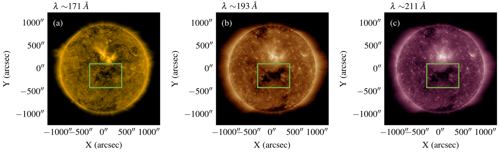
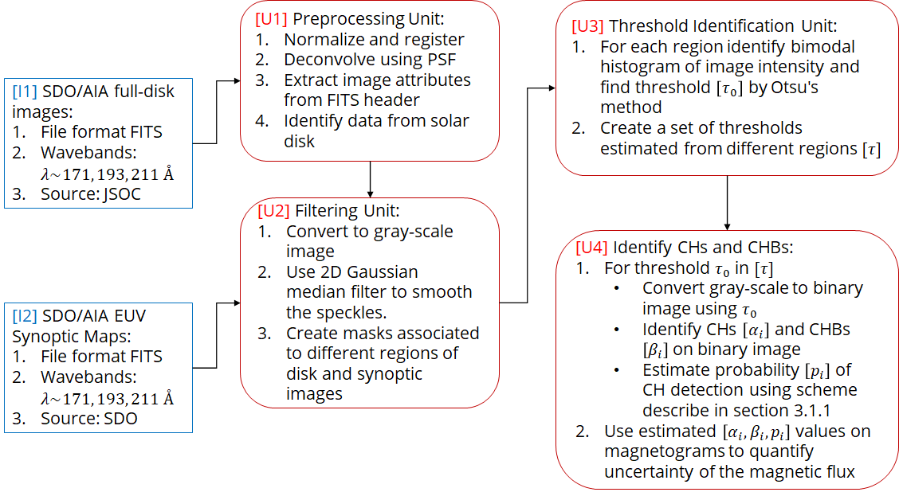
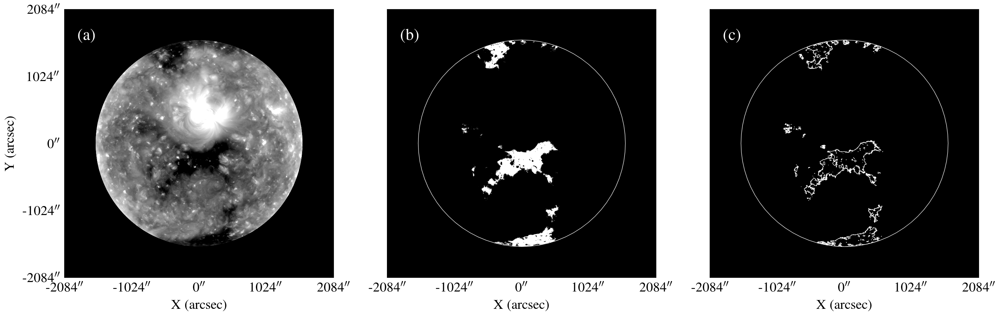
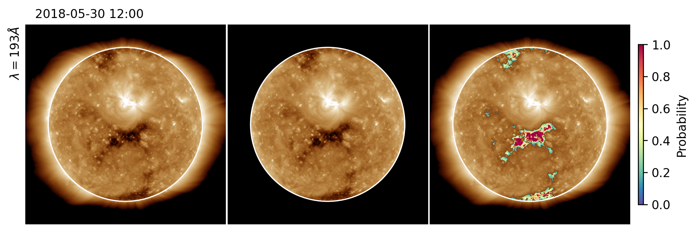

<!-- 
Author(s): Shibaji Chakraborty

Disclaimer:
pyCHIPS is under the MIT license found in the root directory LICENSE.md 
Everyone is permitted to copy and distribute verbatim copies of this license 
document.

This version of the MIT Public License incorporates the terms
and conditions of MIT General Public License.
-->

# Unveiling the Intricacies of CHIPS Algorithm: A Step-by-Step Guide with a Case Study
We delve into the intricacies of the **CHIPS** algorithm. This page offers a comprehensive guide alongside an illustrative example using images captured on 30 May 2018. Despite the array of semi-automatic and automatic schemes available for Coronal Hole Boundary (CHB) detection[@Krista2009;@Garton2018;@Illarionov2018], CHIPS stands out due to its unique selling proposition. What sets CHIPS apart is its ability to provide a **probability** [$\theta$] for the identified Coronal Hole (CH) and its associated CHB. This distinctive feature equips researchers with a quantifiable measure of certainty regarding the detection mechanism. Join us as we navigate through the sequential steps of the CHIPS algorithm, gaining insights into its functionality and the invaluable certainty it brings to CH and CHB identification.

## The CHIPS Pipeline
<figure markdown>

<figcaption>Figure 01: SDO AIA full-disk images of the Sun in three wavebands, (a) 17.1 nm, (b) 19.3 nm, and (c) 21.1 nm taken on 30 May 2018. Example coronal hole located near the central meridian in all three panels.</figcaption>
</figure>

The algorithm is developed to run on full-disk and synoptic images. The basic processing units [**U**] are shared between the different image types. These processing units exploit knowledge from solar physics to segment CHs with different threshold values on the solar disk and then estimate CHBs. This includes the concept that boundaries are best visible in 17.1 nm, 19.3 nm, and 21.1 nm wavebands of AIA images, and the image intensity within CHs are less than their neighboring pixels (shown in Figure 01). Four major stages of the scheme are described below, Figure 02 presents flow diagram of the algorithm, and Figure 03 presents the corresponding outputs from each stage. The algorithm can take either of the 4k resolution images presented in Figure 01 or synoptic maps as an input.
<figure markdown>

<figcaption>Figure 02: Model framework architecture for CHIPS showing the component modules and their interconnection.</figcaption>
</figure>

### Preprocessing Unit
SDO/AIA full-disk images require some preprocessing before further processing. The preprocessing unit calibrates the disk map by (i) updating pointing information, (ii) applying exposure normalization, and (iii) rotating, scaling, and translating the image that aligns the solar North with the y axis, converting each pixel to 0.6 arcsec across, and the put center of the Sun is at the center of the image. In addition, this unit extracts disk radius and center information from the FITS file header, which needs to create a region-based image mask to extract thresholds in the following steps.
<figure markdown>

<figcaption>Figure 03: </figcaption>
</figure>

### Filtering Unit
Preprocessed full-disk images passed to the filtering unit, while EVU synoptic maps from the SDO database are filtered directly for later processing. The filtering units consist of two  primary steps. First, filter the image using a 2D Gaussian median filter with user-defined kernel, to remove the speckle and noise in the image. Gaussian filters can smooth the sharp edges of CHBs, which separates CHs with lower density and temperature compared to the surrounding higher density corona. Hence, the choice of the kernel plays a decisive role in detecting CHs and associated CHBs. We found kernels with a size less than $11\times 11$ with a relatively smaller standard deviation ($\leq 7$) remove small-scale noises and preserve existing CHB structures to be identified by the following steps. Second, the module uses a user-defined sliding window to identify different regions which will process by subsequent processing units to extract intensity thresholds.

### Threshold Identification Unit
For each region identified by the filtering units, we extract the optimal intensity of that using Otsu's method. Otsu's method is an automatic image thresholding algorithm, that estimates a single intensity threshold in a gray-scale image separating image pixels into a foreground and a background[@Otsu]. This method assumes that the intensity histogram is bimodal and  possesses a sharp and deep valley between the two peaks. In addition, we also tried adaptive Gaussian thresholding, which is a region-based thresholding method, but unlike the Otsu's method it determines the threshold for a pixel based on a small region around it. We find the Otsu's method performs better for most cases.

### CHs & CHBs Identification Unit
Once the set of thresholds $[\tau]$ is identified, we use them to convert the gray-scale image into binary images and identify CHs and associated CHBs. For each threshold $I_{th}\in[\tau]$, we estimate the probability of the identified regions being CH by first transforming the pixel intensities into probability space by subtracting a threshold intensity ($I_{th}$) and then applying a sigmoid function to it (as shown in equations (1)-(2)). Assuming, one identified region consists of more than one pixel, we fit a Beta distribution and estimate its parameters ($\alpha, \beta$, in equation (3)).

We then estimate the area enclosed by the distribution $Beta(\alpha,\beta)$ and the vertical line $x_{\tau_{th}}$ (equation (4)). Here, $x_{\tau_{th}}$ is a probability threshold with a value chosen as $x_{\tau_{th}}=0.5$, i.e. $\tau=0$. The measure $\mathcal{F}(I>I_{th},x_{\tau_{th}})$ described in equation (4) is a probability measure (range [0,1]) which defines the potential of a segment S to be a CH. If the measure $\mathcal{F}(I>I_{th},x_{\tau_{th}})\geq 0.5$ for a segment, then we highlight the segment as a CH and draw a contour around it, otherwise ignore it.

\begin{eqnarray}
\tau &=&I^S-I_{th}\\
y_\tau&=&\frac{1}{1+e^{-\tau}}\\
x_\tau&=&\frac{y_{\tau}}{\sum y_{\tau}}\\
Beta(x_\tau|\alpha,\beta)&=&\frac{x_\tau^{\alpha-1}(1-x_\tau)^{\beta-1}}{B(\alpha,\beta)}\\
\mathcal{F}(I^S>I_{th},x_{\tau_{th}})&=&\int_{x_{\tau_{th}}}^1 Beta(x_\tau|\alpha,\beta)dx_\tau
\end{eqnarray}

<figure markdown>

<figcaption>Figure 04: Final CHIPS output of 19.3 nm 4k '.fits' image at different stages.</figcaption>
</figure>

Our analytical journey delves into the intricacies of our assumptions, particularly focusing on the $\beta$ distribution of $x_{\tau}$ and the probability density function $\mathcal{F}(I>I_{th},x_{\tau_th})$. We haveve provided a detailed exploration of these assumptions in a dedicated section [here](probabilities.md), offering transparency and insights into the analytical foundations of the CHIPS. This comprehensive analysis ensures that CHIPS is built on robust assumptions, paving the way for accurate and reliable outcomes in this research. Dive into the details and explore the probabilistic landscape underpinning CHIPS.

\bibliography